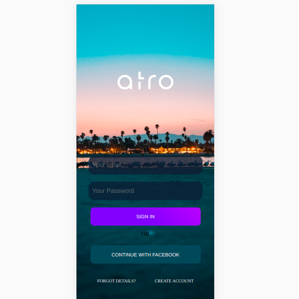

# project2

<a href="https://www.instagram.com/silviolopesdias/">

<a href="https://www.facebook.com/silvio.lopesdias.9/" > 

<a href="https://www.linkedin.com/in/silvio-lopes-dias-516a3a55/">
 

  

> Este projeto teve por objetivo colocar em pratica novas habilidades no HTML e CSS.

### Ajustes e melhorias

O projeto apresenta a tela de abertura de um app.

- [x] Adicionar novas melhorias de acordo com o aprendizado.

## 🤝 Colaboradores

Agradecemos às seguintes pessoas que contribuíram para este projeto:

<table>
  <tr>
    <td align="center">
      <a href="#">
         
        
          <b> Silvio Lopes</b>
        
      </a>
    </td>   
  </tr>
</table>

[⬆ Voltar ao topo](#atro) 

